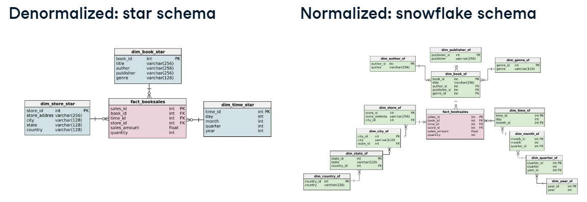

# Databases

## Summary

| Query | Description |
| --- | --- |
| ```FROM information_schema.tables``` | Retrieve tables info in the database |
| ```FROM information_schema.columns``` | Retrieve columns info in the database |

## Introduction

A relational database is made up from Tables (Entities) and
relationships between them.

### Tables

The code to **create a table** is the following.

```postgresql
-- Structure
CREATE TABLE table_name (
    column_a data_type,
    column_b data_type,
    column_c data_type,
);

-- Example
CREATE TABLE weather (
    clouds text,
    temperature numeric,
    weather_station char(5),
);
```

To **modify** the table, ie. add or remove columns, rename,
delete table etc:

```postgresql
-- add column
ALTER TABLE table_name
ADD COLUMN column_name data_type;

-- remove column
ALTER TABLE table_name
DROP COLUMN column_name;

-- rename column
ALTER TABLE table_name
RENAME COLUMN old_name TO new_name;

-- delete table
DROP TABLE table_name;
```

**Migrate** information from one table to another. This is helpful
when getting the information consolidated in a table into
the tables that were created.

```postgresql
-- Structure
INSERT INTO table_name (column_a, column_b)
VALUES  ('value_a', 'value_b');

-- Example using a query
INSERT INTO professors 
SELECT DISTINCT firstname, lastname, university_shortname 
FROM university_professors;
```

### Integrity constraints

To ensure that the data follows a certain structure, rules can
be enforeced into a database: pre-defined model, data types,
relationships, etc.

1. **Attribute constraints**, eg. data types on columns
2. **Key constraints**, eg. primary keys
3. **Referential integrity constraints**, enforced through foreign
keys.

#### Most common data types

| Data type | Description |
| --------- | ----------- |
| ```text``` | character strings of any length |
| ```varchar(x)``` | a maximum of *x* characters |
| ```char(x)``` | a fixed-length string of *x* characters |
| ```boolean``` | ```TRUE```, ```FALSE``` or ```NULL``` values |
| ```date```, ```time``` and ```timestamp``` | various formats for date and time calculations |
| ```numeric``` | arbitrary precission numbers, eg. ```3.1457``` |
| ```integer``` | whole numbers in a range of ```[-2,147'483,648, -2,147'483,647]``` |

Example:

```postgresql
-- creation
CREATE TABLE students (
    ssn integer, 
    name varchar(64),
    dob date,
    average_grade numeric(3, 2) -- precision of 3 and a scale of 2; eg. 5.54
    tuition_paid boolean
);

-- modify
ALTER TABLE students
ALTER COLUMN name
TYPE varchar(128)
-- Turns 5.54 into 6, not 5, before type conversion
USING ROUND(average_grade);
-- this last part allows to use a function before changing the type
```

#### Not-null and unique constraints

* Not-null: doesn't allow the column to hold null values
* Unique: disallow duplicate values

```postgresql
-- creating attribute with not-null and unique constraint
CREATE TABLE table_name (
    column_name1 integer NOT NULL,
    column_name1 integer UNIQUE
);

-- after creation not-null
ALTER TABLE table_name
ALTER COLUMN column_name1
SET NOT NULL;

-- after creation unique
ALTER TABLE table_name
ADD CONSTRAINT some_name UNIQUE(column_name2);
```

#### Keys

Uniquely identifies each record on a database. This makes it
easier to reference those records from other tables.

* **Key**: an attribute that can identify a record uniquely
  * The combination of tow or more attributes might be a key on
    itself if the combinations are unique

* **Primary key**: it must be:
  * One per database table, chosen from candidate keys
  * Uniquely identifies records
  * Unique and not-null constraints both apply
  * Primary keys are time invariant (must hold for current and
  future data on the table)
  * Can have more than one column. It's better to use as few
  columns as possible

```postgresql
-- create table setting one column as primary key
CREATE TABLE table_name (
key_col type PRIMARY KEY,
column_b type
);

-- using more than one column as primary key
CREATE TABLE example (
a int,
b int,
c int,
PRIMARY KEY (a, c)
);

-- add one after creation
ALTER TABLE table_name
ADD CONSTRAINT some_name PRIMARY KEY (column_name)
-- this just makes the column_name the primary key
```

* **Surrogate key**: diffrent from the primary key, it isn't
tied to any attribute. It is "artificially" generated in the
sense that it is only a SERIAL column, assigning a number from
the sequence to each record.

```postgresql
-- Add the new serial column to the table
ALTER TABLE table_name 
ADD COLUMN id SERIAL;

-- Make id (the serial column) a primary key
ALTER TABLE professors 
ADD CONSTRAINT professors_pkey PRIMARY KEY (id);
```

#### Relationships

* **Foreign key**: they are designated columns that point to
a primary key of another table. 
  * Each value of the FK must exist in the PK of the other
  table (FK Constraint or "referential integrity")
  * It can hold duplicates and ```NULL``` values

##### Specifying foreign keys in a table

```postgresql
-- from creation
CREATE TABLE table_a (
    a int PRIMARY KEY
    -- allow only values from pk column in table_b
    b varchar(255) REFERENCES table_b (pk_table_b)
); -- This will return an error when trying to add a different value

-- modify
ALTER TABLE table_a
ADD CONSTRAINT a_fkey FOREIGN KEY (b_id) REFERENCES table_b(pk_table_b)

-- add a foreign key using other columns*
UPDATE affiliations
SET professor_id = professors.id
FROM professors
WHERE affiliations.firstname = professors.firstname AND affiliations.lastname = professors.lastname;
```
\* In this example, supose the affiliations table has the 
professors ```firstname``` and ```lastname``` columns.
Professors table has ```firstname```, ```lastname``` and an
```id``` column. The query updates an empty ```professor_id```
column in the affiliations table using the ```firstname``` and
```lastname``` columns to look for ```professors.id```. 

#### Referential integrity violations

The records in column ```fk``` in table b should always point to
the values in column ```pk``` in table a.

The violation of this rule can be handled in different ways:

```postgresql
CREATE TABLE a (
    id INTEGER PRIMARY KEY,
    ...,
    b_id INTEGER REFERENCES b (id) ON DELETE NO ACTION -- default
);
```
```ON DELETE...```

* ```... NO ACTION```: Throw an error
* ```... CASCADE```: Delete all referencing records
* ```... RESTRICT```: Throw an error
* ```... SET NULL```: Set the referencing column to ```NULL```
* ```... SET DEFAULT```: Set the referencing column to its default
value

```postgresql
-- Identify table constraints
SELECT constraint_name, table_name, constraint_type
FROM information_schema.table_constraints
WHERE constraint_type = 'FOREIGN KEY';
```

## Database design

Answers the question how to organize and manage data.

### OLTP vs OLAP

There are two common approaches to storing data, they define
the way the data is going to flow, be structured and stored,
they are:

* **OLTP**: Online Transaction Processing
  * Consulting/Immediate transactions (ex. find price of article)
* **OLAP**: Online Analytical Processing
  * Analysis/reporting (ex. analyze price trends of articles)

|    | OLTP | OLAP |
|--- | ---- | ---- |
| Purpose | support daily transactions | report and analyze data |
| Design | application-oriented | subject-oriented |
| Data | up-to-date, operation | consolidated, historical |
| Size | snapshot, gigabytes | archive, terabytes |
| Queries | simple transactions & frequent updates | complex, aggregate queries & limited updates |
| Users | thousands | hundreds |

## Storing data

It can be stored in three different types:

1. Structured data
   * Follows a schema
   * Defined data types & relationships
2. Unstructured data
   *  Schemaless
   *  Makes up most data in the world
3. Semi-structured data
   * Doesn't follow a large schema
   * Self-describing structure (NoSQL, XML, JSON)

#### Ways of storing data

* **Tranditional database**
  * Relational structured data
* **Data warehouses**
  * Organized for reading/aggregating data
  * Contains data from multiple source (tabular format)
  * Massively Parallel Processing (MPP)
  * Uses denormalized schema and dimensional modeling
  * Allows **data marts**:
    * Subset of data warehouse dedicated to a specific topic
  * Follow ETL approach
* **Data lake**
  * Uses object storage to store all types of data at a lower cost
  * Retains all data and can take up petabytes
  * Schema-on-read as opposed to schema-on-write, i.e. the schema
    is defined when data is read, instead of puting the data into
    a pre-defined schema
  * If data is uncatalogued it becomes a **data swamp**
  * Can run big data analytics using services as Apache Spark
    and Hadoop
  * Usually follows ELT approach

## Normalization

### Star schema vs Snowflake schema

* **Star schema**: holds several *Dimension Tables* connected directly
  to the *Facts Table*
* **Snowflake schema**: it is an extension of the star schema, it
  avoids redundancy by normalizing the dimension tables, i.e. it
  extends teh dimension tables one or more levels.



### Normalization

Normalization is used identify repeating groups of data and
create new tables for them.

#### Advantages of Normalization

* Saves space by eliminating data redundancy
* Enforces data consistency
  * The naming conventions must be respected for referential
    integrity
* Safer updating, removing and inserting
  * To update a value, only one table has to be modified as
    opposed to all tables having that value
  * If you remove a value there will be other columns/information
    that will be lost
* Easier to redesign by extending

#### Disadvantages

* Requires complex queries
* Complex queries require more CPU

\* *Normalization is prefered for OLTP and denormalization for*
*OLAP*

#### Forms of Normalization

* **1NF**: a single cell doesn't hold more than one value
* **2NF**:  A relation that is in First Normal Form and
  every non-primary-key attribute is fully functionally
  dependent on the primary key
* **3NF**: A relation that is in First and Second Normal 
Form and in which no non-primary-key attribute is transitively
dependent on the primary key

## Views

Query stored in memory. Virtual table, it doesn't take up
storage.

```postgresql
-- create a vew
CREATE VIEW view_name AS
SELECT col1, col2,
FROM table_name
WHERE condition;

-- query the view
SELECT * FROM view_name

-- get all non-systems views in postgresql
SELECT * FROM INFORMATION_SCHEMA.views
WHERE table_schema NOT IN ('pg_catalog', 'information_schema');

-- modifying a view (must keep same column order)
CREATE OR REPLACE VIEW view_name AS new_query

-- dropping av iew
DROP VIEW view_name [ CASCADE | RESTRICT] -- for dependable objects*
```
\* **Dropping views**
* ```RESTRICT``` (default): returns error if an object depends 
  on the view
* ```CASCADE```: drops view and any object that depends on it

### Materialized views

* Store the query results, not the query
* It is faster because it has the query results in memory
* Refreshed or rematerialized when promted or scheduled
* Good for queries with long execution time

```postgresql
-- create materialized view
CREATE MATERIALIZED VIEW my_mv AS
SELECT * FROM table_name;

-- execute refresh
REFRESH MATERIALIZED VIEW my_mv;
```

## Database management

### Roles and access control

#### Database roles

* Manage database access permissions
* Defines roles privileges (login, create databases, write
  tables, etc.)
* Interacts with authentication systems
* Roles can be assigned to one or more users
* Roles are global across database cluster installation

```postgresql
-- create empty role
CREATE ROLE role_name;

-- create role with login privilege
CREATE ROLE marta LOGIN;

-- create role with createdb and createrole privileges
CREATE ROLE admin WITH CREATEDB CREATEROLE;

-- create role with pwd and expiration
CREATE ROLE role_name WITH PASSWORD 'pwd_string' VALID UNTIL '2024-12-31';

-- modify role
ALTER ROLE role_name CREATEDB; --allow db creation

-- grant/revoke update-access to view/table
GRANT UPDATE ON ratings TO data_analyst;
REVOKE UPDATE ON ratings TO data_analyst;
```

**Available privileges for roles**: ```SELECT```, ```INSERT```,
```UPDATE```, ```DELETE```, ```TRUNCATE```, ```REFERENCES```,
```TRIGGER```, ```CREATE```, ```CONNECT```, ```TEMPORARY```,
```EXECUTE``` and ```USAGE```.

#### User and group roles

Group roles are meant for a broader audience. User roles tend
to be more specific. It is possible to assign a group role to
a user:

```postgresql
-- group role
CREATE ROLE data_analyst;

-- assign group role to user role
CREATE ROLE john_doe WITH PASSWORD 'pwd' VALID UNTIL '2024-12-31';
GRANT data_analyst TO john_doe; -- grant
REVOKE data_analyst TO john_doe; -- revoke  
```

### Table partitioning

When data is too large, it can be partitioned vertically (by
columns) or horizontally (by rows).