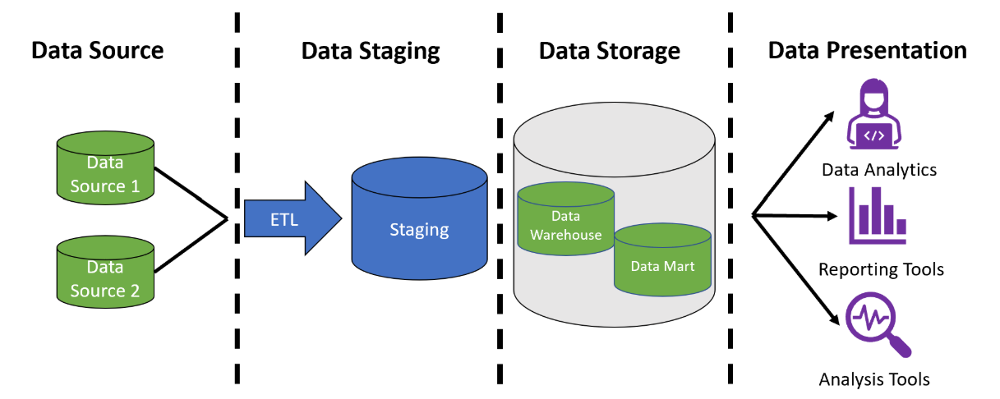
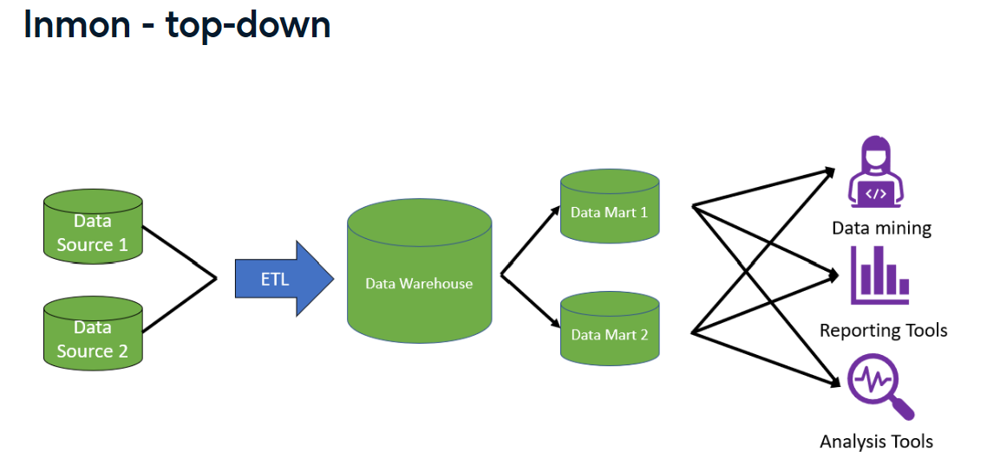
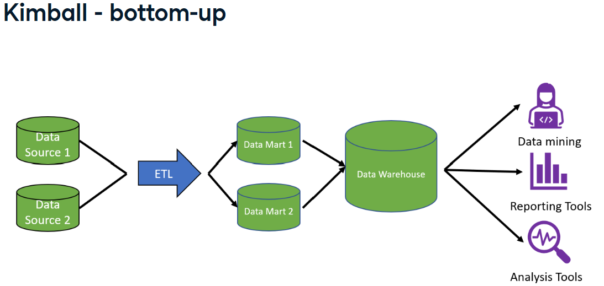

# Data Warehouses

## Index

## Basics

A data warehouse is a computer system designed
to store and analyze large amounts of data for
an organization.

* It gathers data from different areas
* Integrates and stores the data
* Make it available for analysis
* Supports business intelligence activity

### Data warehouses vs data lake

#### Data warehouse

* Stores structured data
* Gather data, integrate, makes it available for analysis
* Many input data sources
* Complex to change
* Typically >100 GB
* **Datamart**
  * It can be an extension of a *Data Warehouse*
  * A relational database for analysis
  * Data is focused on one subject area
  * Few input data sources
  * <100 GB

#### Data lake

* Stores structured and unstructured data (video, audio, 
  documents, etc.)
* Entire organization store of data
* Contains data from many departments
* Many data input sources
* Less complex to make changes
* Less organized
* Typically >100 GB

### Data warehouse cycle

1. **Planning**: involves requirements gathering and data
  modeling to understand organizational needs and how to
  structure the data warehouse.
2. **Implementation**: centers on designing the ETL process
  and developing BI applications to interact with the data
  warehouse.
3. **Support and maintenance**: focuses on updating the warehouse,
  testing, deployment, and making necessary changes to meet
  business requirements. 

## Architectures and properties

### Layers of data warehouse

1. **Data sources**:
2. **Data staging**:
   * Extracts, transforms and cleans data
   * Contains ETL process and storage tables
3. **Data storage**:
   * Data pipelines store the staging result in the data
    warehouse or data marts
4. **Data presentation**:
   * Users interact with stored data (BI, data mining,
      direct queries)



### Architectures

#### Inmon Top-down approach

* The organization sets all the data definitions, cleaning,
  and business rules before any data enters the warehouse
* It stores data in a normalized forms
* After getting to the warehouse, the data moves to
  department-focused data marts where end users and
  applications can query it.
* Pros:
  * Single source of truth
  * Normalization = less storage
  * Easy to change data marts to support reporting changes
* Cons:
  * More joins = slower response time
  * Upfront work (higher startup cost)



#### Kimball Bottom-up approach

* Once the data has been brought in, it is denormalized into
  a star schema
* Focus on getting from data to reporting as fast as possible
* It first organizes and defines the data of one department of
  the organization and places that data into a data mart, making
  it available for reporting. After completing one department,
  a new one is chosen, repeating the cycle.
* Various data attributes connect the data marts. The data marts
  are then integrated into a data warehouse.
* Pros:
  * Upfront development speed (lower startup cost)
  * Denormalization = user friendly
* Cons:
  * Increased ETL processing time
  * Greater possibility of duplicate data
  * Ongoing development needed



## Data modelling

Data modeling is done using a fact table and dimension tables,
using either a star schema (for speed) or a snowflake schema
(for space).

* **Fact table**: holds the information that is being studied. The
  dimension tables are connected to it.
* **Dimension tables**: holds the information that provide
  descriptive context to the fact table attributes.

#### Kimball's four step process

This process allows to define the schema of a data warehouse:

1. Select the organizational process
   * Asks questions about a process
2. Declaire the grain
   * Defines granularity of the data
   * Grain = level to store fact table
3. Identify the dimensions
   * Choose dimensions that apply to each row
   * How to describe the data
4. Identify the facts
   * Numerical facts for each fact table row
   * What are we answering?

### Row vs column data storage

Data is stored in blocks. It can be stored in either row or
column storage:

* **Row Store**:
  * Row data is stored together in blocks.
  * This means that records (the combination of all attributes)
    in a row, are stored in a block.
  * This type is ideal for transactional workloads.
  * Examples: Postgresq, MySQL, Oracle, Microsoft SQL Server
* **Column store**:
  * Column data is stored together in blocks.
  * This means that a whole column will be in a block.
  * Ideal for analytical workloads, as only the blocks with
    columns that are being queried are accessed.
  * Better data compression.
  * Examples: Snowflake, Amazon Redshift, Google BigQuery, Vertica

## ETL and ELT

### ETL (Extract - Transform - Load)

* Data is transformed before making it to the warehouse
  * It uses a separate system to process the data (extra cost for
    cloud services or on premises)
* Lower data storage costs as data is cleaned
* Easy security compliance
* Transformation errors/changes require new data pulls

### ELT (Extract - Load - Transform)

* Extracts data and loads full copies of it into the data warehouse
  * The resources and software of the data warehouse are used to
    transform the data
* Transformation can be re-run without impacting source systems
* Works well for near real-time requirements
* Increased storage costs (for raw data)

### Cloud data warehouses

**Pros:**
* No maintaining equipment infrastructure
* Can scale storage and computer resources
* No upfront investment

**Cons:**
* Less control
* Cannot optimize warehouse workloads
* Possible unanticipated costs (spike on usage)

**Examples:**
* Amazon redshift
* Azure synapse analytics
* Snowflake
* Google big query

## Snowflake

* Cloud based datawarehouse solution
* Columnar data storage
* It uses SQL for data querying

### Architecture

* Shared-nothing architecture (decoupling compute and storage)
  * Contrary to shared-disk, where each node (processor) has its
    own memory and CPU but share the same storage, shared-nothing
    separates storage and compute, each node has its own storage.
  * This ensures data is stored efficiently and processed
    independently. Each component can operate without relying on
    the other
  * This means enhanced scalability
* The components of snowflake's architecture are:
  1. Storage layer
     * Columnar storage, optimized, compressed,
      tables/schemas/databases
  2. Compute/query processing layer
     * Where queries are processed.
     * It uses virtual warehouses, which are temporary computing
      resources when an user submits a query. They work separaetly
      on the query for peak performance.
  3. Cloud services layer
     * This layer ensures that when a query is ran, the right amount
      resources, compute, and storage are allocated for quicker
      results. 

### Competitors:

* Amazon redshift
* Google BigQuery
* Databricks (kind of)

## SnowSQL

### Connecting to Snowflake

* Snowsight: Snowflake web interface
* **Drivers and connectors**:
  * ODBC (Open Database Connectivity) driver
  * JDBC (Java Database Connectivity) driver
  * Python/Spark connector
  * SnowSQL: command-line client

### DDL (Data Definition Language)

```postgresql
--create table
CREATE TABLE table_name (
  id NUMBER,
  date_col DATE,
  time_col TIME
);

-- create view
CREATE VIEW table_view
SELECT id, time_col
FROM table_name;

-- alter, rename, drop
ALTER TABLE IF EXISTS table_name RENAME to other_name;

ALTER TABLE othe_name
RENAME COLUMN time_col to times;

DROP TABLE other_name;

-- comment on column/table
CREATE pizza_type (
  pizza_type_id VARCHAR(50) COMMENT 'Unique identifier',
  ...
)
COMMENT = 'This is the comment for the table pizza_type'
```

### Database exploration

```sql
-- list databases information
SHOW DATABASES

-- explore tables
SHOW TABLES IN {DATABASE [<db_name>]}
SHOW TABLES LIKE '%substring%' --by table name

-- show schemas, columns, views
SHOW SCHEMAS IN DATABASE DB_NAME
SHOW COLUMNS IN DATABASE DB_NAME
SHOW VIEWS IN DATABASE DB_NAME

-- describe database, schema, tables, columns
DESCRIBE DATABASE DB_NAME
DESCRIBE SCHEMA PUBLIC
DESCRIBE TABLE table_name
DESCRIBE VIEW view_name
```

### DML (Data Manipulation Language)

```sql
-- insert values explicitly or by query
INSERT INTO orders (order_id, order_date, order_time)
VALUES (1, '2015-01-01', '11:38_36')

INSERT INTO orders_filtered
  SELECT * FROM orders
  WHERE order_date > '2015-01-02'

-- update to modify records
UPDATE orders
SET order_time = '17:00:00'
WHERE order_id = '5'
```

#### COPY INTO

Used to add data from a specified file or stage into a
Snowflake table.

A stage is a "waiting area" where data files are temporarily
stored before they are loaded into the main tables.

```sql
-- create stage
CREATE STAGE my_local_stage
PUT file:///path_to_local_file/orders.csv
@my_local_stage -- stage name prefixed with @

-- copy data into table
COPY INTO orders FROM @my_local_stage/orders.csv
FILE FORMAT = (TYPE = 'CSV' SKIP_HEADER=1)
```

### Datatypes

| Datatype | Description |
| --- | --- |
| ```VARCHAR``` | variable lenght string |
| ```NUMERIC``` | float or int |
| ```INT``` | integer |
| ```DATE``` | date in *YYYY-MM-DD* format |
| ```TIME``` | time in *HH:MI:SS* format |
| ```TIMESTAMP``` | date + time |
| ```VARIANT``` | supports OBJECT and ARRAY data types |

#### Cast column

```sql
CAST (<source_data/column> AS <target_data_type>)
-- ex
CAST('90' AS INT)
-- or
'90'::INT
```

### Other queries
```sql
-- groups by all columns in select
SELECT *
FROM ...
GROUP BY ALL
```

### JOINS

Joins work similarly to postgresql. There are a couple
that will be reviewed: NATURAL and LATERAL JOINs.

#### NATURAL JOIN

Joins the tables without explicitly stating the matching
conditions. It will take the columns from both tables that
are named the same and avoid duplication. 

It is combined with the other join types.

\*Works similar as merge in pandas.

```sql
-- natural join
SELECT *
FROM pizzas AS p
NATRUAL JOIN pizza_type as t
```

### Query optimization

To save time and computing power special focus can be put
in the following steps:

* Use ```UNION ALL``` if we are sure data doesn't have duplicates
* Use **filters** to narrow data and apply **limits** for
  quicker results
* ```SELECT``` only necessary columns
* Use ```WHERE``` clause early, for example, use it before
  the ```JOIN``` with a Common Table Expression (CTE) before
  the query.
* Analyze query performance with **Query history**:

```postgresql
-- query history
SELECT
  query_text,
  start_time,
  end_time,
  execution_time -- miliseconds
FROM snowflake.account_usage.query_history
WHERE query_text ILIKE '%table_name_ex%'
```

### Handling semi-structured data

Semistructured data has JSON (JavaScript Object Notation)
format.

The ```VARIANT``` datatype in Snowflake can hold:
* OBJECT: ```{"key": "value"}```
* ARRAY: ```["list", "of", "values"]```

```postgresql
CREATE TABLE cust_info_json_data (
  customer_id INT,
  customer_info VARIANT -- variant data type
);

-- convert to json format
SELECT PARSE_JSON(
  ' -- enclosed in strings
    { 
      "cust_id": 1,
      "cust_name": "cust1",
      "cust_age": 40,
      "cust_email":"cust1@gmail.com"
    }
  '-- enclosed in strings
) AS customer_info_json

-- return json object
SELECT OBJECT_CONSTRUCT(
  'cust_id', 1,
  'cust_name', 'cust_1',
  'cust_age', 40,
  'cust_email', 'cust1@gmail.com'
) -- returns the same as the last query

-- query json data
SELECT
  customer_info:cust_age,-- using colon to access data from column
  customer_info:cust_name,
  customer_info:cust_email:email_1, -- nested object
FROM
  cust_info_json_data;

```